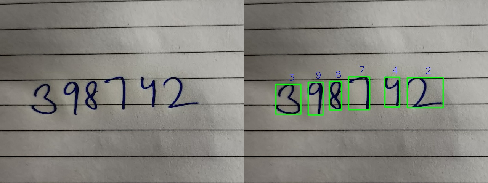

<h1 align="center"> :four: Handwritten Digit Recognition :two:</h1>

<p align="center">
  <br>
  <b><i>OCR numbers written by hand using OpenCV and TensorFlow.</b></i>
  <br><br>
</p>

<h1 align="center"> :wrench: Dependencies and Installation </h1>
Run the following commands either in the global environment or in a virtual environment (<i>recommended</i>).
<br><br>

```
>pip install tensorflow>=2.2.0
>pip install opencv
>pip install scikit-learn
>pip install matplotlib
```

<h1 align="center"> :runner: How to Run? </h1>
Open a terminal and run the following command.
<br><br>

```
>python recognize_digits.py -i $path_to_img$
```

<h1 align="center"> :scroll: Details</h1>

* Preprocessing done using OpenCV, using the Preprocessor class, which takes in an image, and returns the binary thresholded image after removing any lines (if any).
* Three preprocessing methods provided, with the default being the 2nd as it performed the best in most conditions. Detects the probable regions using Canny 
and findContours and calculates the threshold value for those regions using the mean and standard deviation.
* Sometimes a digit is detected as multiple different ones using Canny, so ```getExternalContours``` function has been implemented in ```imutils.py``` 
which merges contours that are overlapping. 
* If lines are detected in the image, they are removed using morph open, and the digits are then extracted.
* Before being passed into the model, digits are straightened and centralized to maintain a similar structure to that of the training data.
* The prediction is done using an ensemble of 5 CNN's with the architecture chosen and trained by using the performance on the MNIST dataset.
* Dropout, Batch Normalisation and Image Augmentation are applied to reduce overfitting and increase the robustness of the model.
* Each of the five CNN's gave a validation accuracy between 99.68% and 99.75% on the MNIST dataset.
* Custom Image Augmentation is also applied during prediction time using the DigitAugmenter class, so the models see multiple transformed versions of the same image 
for a single prediction, and the highest average prediction is chosen to improve generalization and the robustness of the model.
<br><br>

<h1 align="center">:bar_chart: Results</h1>

<p align="center">
  <br><br>
  
  <br><br>
</p>
                                               
<p align="center">
  <br><br>
  
  <br><br>
</p>
                                              
<p>
  <br><br>
  
  <br><br>
</p>
                                                                                      
<h1 align="center">:clap: Credits and Inspiration</h1>

* <i>Dr. Adrian Rosebrock</i> - His book on OpenCV and his blog have helped tremendously.
* ```imutils.py``` is a modified version of Dr. Rosebrock's package ```imutils```.
* Architecture of the CNN inspired by [this post.](https://www.kaggle.com/cdeotte/how-to-choose-cnn-architecture-mnist/)
<br><br>

<h1 align="center">:pray: Thanks!</h1>

<p align="center">
  <b>All contributions are welcome and appreciated. :+1: </b>
  <br><br>
  <br>
  <b> BYE! </b><br><br>
  <a href="https://github.com/rg089"></a>
  <br>
  <b><i>Rishabh Gupta :copyright:</b></i>
</p>
